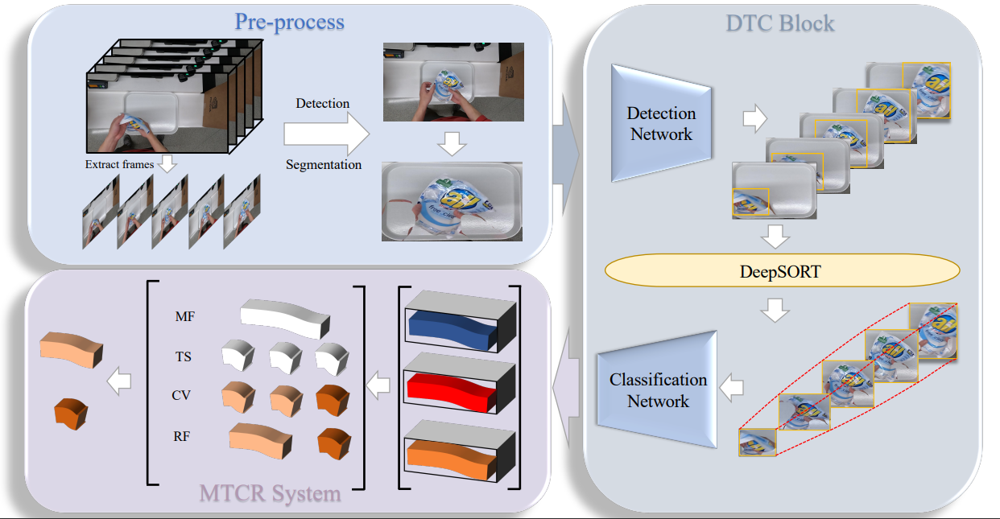

Amazing Results With Limited Data In Multi-Class Product Counting and Recegnition.
===

This project (based on [mmdetection](https://github.com/open-mmlab/mmdetection) && [mmclassification](https://github.com/open-mmlab/mmclassification) && [DeepSort](https://github.com/nwojke/deep_sort)) is the re-implementation of our paper.

## Introduction

In light of challenges and the characteristic of Automated retail checkout, we propose a precise and efficient framework. In the training stage, firstly, we use MSRCR to process training data, which has perfect performance in image enhancement by applying it on each color channel independently. Secondly, the processed data can be used to train the classifier, and it can also be randomly pasted into the background to train the detector. In the testing stage, we first preprocess the video, detect the white tray and the human hand area, then detect, track and classify the products in the white tray, and finally process the trajectory through the MTCR algorithm and output the final results.



## Data-Preparing

### 1. Training
1. Download images and annotations for training detection from [GoogleDrive-det](https://drive.google.com/file/d/1zhIEYGuDviOr4N5ZV8nNbWcIDSB2a2oY/view?usp=sharing).
2. Download images for training classification from [GoogleDrive-cls](https://drive.google.com/file/d/1k1k6b-cQ9UEh5_L3pVi1DHuYeqovi2Va/view?usp=sharing).
3. Download pre-trained models for training from [GoogleDrive-models](https://drive.google.com/file/d/1V0cFkuZWHTaLlYuZnFhIhhT3HgWJMWbG/view?usp=sharing)
```
data
├── coco_offline_MSRCR_GB_halfbackground_size100_no-ob_1
│   └── annotations
│   └── train2017
│   └── val2017
├── alladd2
│   └── meta
│   └── train
│   └── val

models
├── detectors_cascade_rcnn_r50_1x_coco-32a10ba0.pth
├── efficientnet-b0_3rdparty_8xb32_in1k_20220119-a7e2a0b1.pth
├── efficientnet-b2_3rdparty_8xb32_in1k_20220119-ea374a30.pth
├── resnest50_imagenet_converted-1ebf0afe.pth
├── resnest101_imagenet_converted-032caa52.pth
```

### 2. Testing
Please place the videos you want to test in the [test_videos](./test_videos) folder.
```
test_videos/
├── testA_1.mp4
├── testA_2.mp4
├── testA_3.mp4
├── testA_4.mp4
├── testA_5.mp4
├── video_id.txt
```

## Quick & Easy Start

### 1. Environments settings

* python 3.7.12
* pytorch 1.10.0
* torchvision 0.11.1
* cuda 10.2
* mmcv-full 1.4.2
* tensorflow-gpu 1.15.0

```shell
1. conda create -n DTC python=3.7
2. conda activate DTC
3. git clone https://github.com/w-sugar/DTC_AICITY2022
4. cd DTC_AICITY2022
5. pip install -r requirements.txt
6. sh ./tools/setup.sh
```
Prepare train&test data by following [here](#data-preparing)

### 2. Train/Test:

* Step1: training.
```shell
# 1. Train Detector
# a. Single GPU
python ./mmdetection/tools/train.py ./mmdetection/configs/detectors/detectors_cascade_rcnn_r50_1x_coco.py
# b. Multi GPUs(e.g. 2 GPUs)
bash ./mmdetection/tools/dist_train.sh ./mmdetection/configs/detectors/detectors_cascade_rcnn_r50_1x_coco.py 2

# 2. Train Classifier
# a. Single GPU
bash ./mmclassification/tools/train_single.sh
# b. Multi GPUs(e.g. 2 GPUs)
bash ./mmclassification/tools/train_multi.sh 2
```

* Step2: testing.
Please place the all models in the [checkpoints](./checkpoints) folder. These models can be downloaded from [Model-Zoo](https://drive.google.com/file/d/1nD80vqJQGEE2fL-sMx-cm6O5Q-uL7kF-/view?usp=sharing)
```
checkpoints/
├── s101.pth
├── s50.pth
├── feature.pth
├── b2.pth
├── detectors_htc_r50_1x_coco-329b1453.pth
├── detectors_cascade_rcnn.pth
```

Command line
```shell
# 1. Use the FFmpeg library to extract/count frames.
python tools/extract_frames.py --out_folder ./frames
# 2. DTC
python tools/test_net.py --input_folder ./frames --out_file ./results.txt
# Note: If using your own trained model weights, use the following command:
python tools/test_net.py --input_folder ./frames --out_file ./results.txt --detector ./mmdetection/work_dirs/detectors_cascade_rcnn/latest.pth --feature ./mmclassification/work_dirs/b0/latest.pth --b2 ./mmclassification/work_dirs/b2/latest.pth --resnest50 ./mmclassification/work_dirs/resnest50/latest.pth --resnest101 ./mmclassification/work_dirs/resnest101/latest.pth
```

# Contact

If you have any questions, feel free to contact Junfeng Wan (wanjunfeng@bupt.edu.cn).
